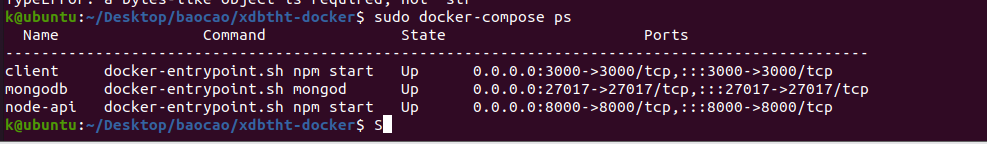

quy trình 

chạy fe -> chạy mongodb -> chạy be


fe : 

chạy nginx

​	copy build vào www -> sửa config -> 

sudo npm run build


sudo cp -R build /var/html


----------


install mongo

wget -qO - https://www.mongodb.org/static/pgp/server-6.0.asc | sudo apt-key add -


sudo apt install mongodb-server-core


#### Creating a MongoDB Database with the CLI

show dbs

There is no “create” command in the MongoDB shell. In order to create a database, you will first need to switch the context to a non-existing database using the use command:

**use book**

ta cần tạo database tên book 

sử dụng mongo

To add a document to your database, use the [db.collection.insert()](https://docs.mongodb.com/manual/reference/method/db.collection.insert/) command.

db.user.insert({name: "Chu Tuan Kiet",  publisher: "chutuankiet", type: "hai kich", author:"CTK", nation:"VN"})


npm run


Lỗi -> sửa quyền cho /data/db


-------------


### Install Tmux on Ubuntu 

sudo apt-get install tmux


dùng tmux để chạy các session khác nhau 

- fe
- be
- mongodb


## tmux Commands

Để chạy Tmux, bạn mở session mới bằng lệnh sau:

```
tmux new
```

Bạn cũng có thể đặt tên session bằng lệnh sau:

```
tmux new -s [session_name]
```

Để kết thúc session, bạn cần gõ lệnh sau:

```
exit
```

chúng ta sử dụng lệnh detach (tách phiên). Đầu tiên là gõ prefix bằng phím **CTRL+B** tiếp theo gõ lệnh **D**. Chúng ta sẽ thấy thông báo trong terminal

```
tmux attach -t [session_name]
```

Vì chúng ta chưa đặt tên cho session mới giá trị sử dụng sẽ là 0. Lệnh như sau:

```
tmux attach -t 0
```


```
CTRL+B, 1
```


Để thấy có bao nhiêu Tmux session, bạn gõ lệnh sau:

```
tmux ls
```


### Sessions

Tạo session mới:

```
tmux
```

Tạo một session mới có tên:

```
tmux new -s [name]
```

Tạo một session được ghép kênh:

```
tmux attach #
```

Ghép một session vào Tmux có sẵn:

```
tmux attach -t [name]
```

Liệt kê các session tmux:

```
tmux ls
```

Thoát ứng dụng:

```
exit
```

### Quản lý cửa sổ 

| Cửa sổ mới             | <prefix>+c |
| ---------------------- | ---------- |
| Cửa sổ tiếp theo       | <prefix>+n |
| Liệt kê toàn bộ cửa sổ | <prefix>+w |
| Đặt tên cửa sổ         | <prefix>+, |

### Quản lý panel 

| Chia panel theo chiều dọc     | <prefix>+%         |
| ----------------------------- | ------------------ |
| Chia panel theo chiều ngang   | <prefix>+“         |
| Tắt pane                      | <prefix>+x         |
| Hiển thị số panel             | <prefix>+q         |
| Chuyển qua lại giữa các panes | <prefix>+arrow key |


-------

mất biểu tượng mạng ubuntu


#### nmcli

Đây là một công cụ khác để xử lý các vấn đề về mạng trên Linux. Nó là một công cụ mạnh mẽ mà rất nhiều SysAdmin rất hay dùng vì nó dễ sử dụng. Để sử dụng nmcli khởi động lại mạng ta phải dùng 2 lệnh.

`sudo nmcli networking off //Tắt nó đi`
`sudo nmcli networking on //bật nó lại`


------------------

.
├── database
│   └── mongo-init.js
├── demo-app-be
│   ├── Dockerfile
│   ├── package.json
│   ├── package-lock.json
│   ├── /src
│   └── tsconfig.json
├── demo-app-fe
│   ├── Dockerfile
│   ├── package.json
│   ├── package-lock.json
│   ├── /public
│   ├── /src
│   ├── tsconfig.json
│   └── yarn.lock
└── docker-compose.yml

## docker compose 


lỗi do network của docker chưa được setup

sửa file **/etc/docker/daemon.json**

thêm 

```
{
    "dns": ["10.0.0.2", "8.8.8.8"]
}
```

```
sudo service docker restart 
hoặc sudo systemctl restart docker
```

để khởi động lại docker

```
sudo docker compose up
```

https://github.com/StefanScherer/dockerfiles-windows/issues/270


cài đặt xong client 


---------------


chạy docker compose up 


lỗi **Local package.json exists, but node_modules missing**


mình mount luôn cái node_modules  đã cài trên host để fix lỗi





